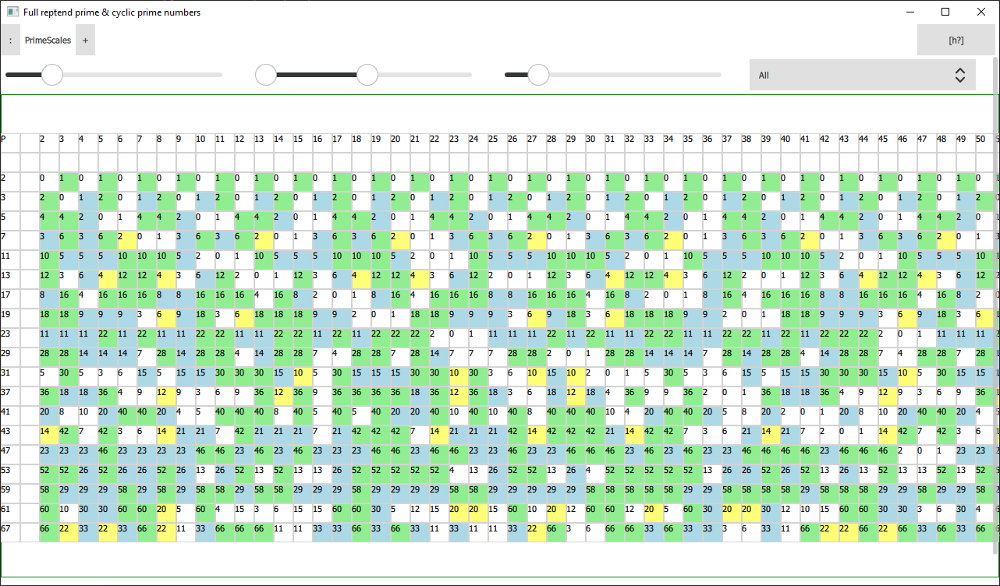
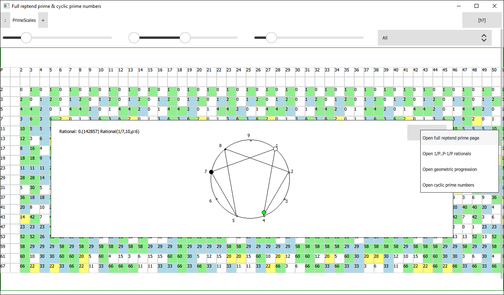
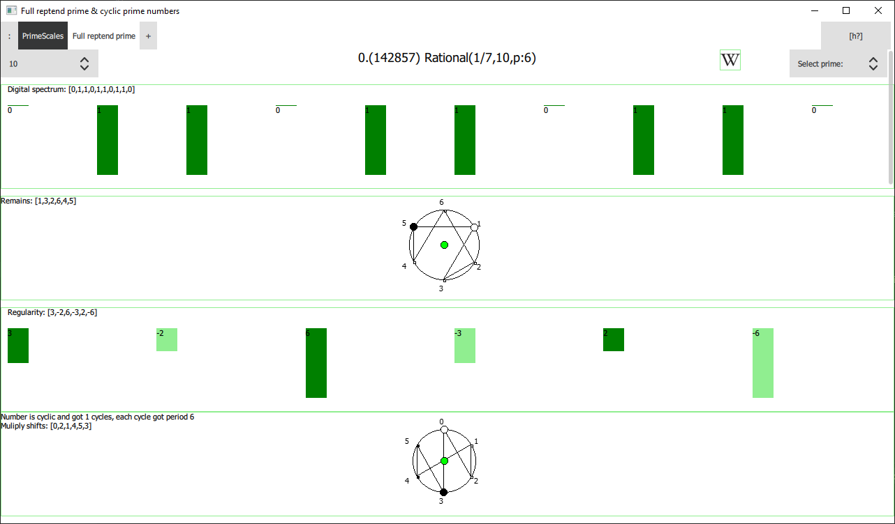
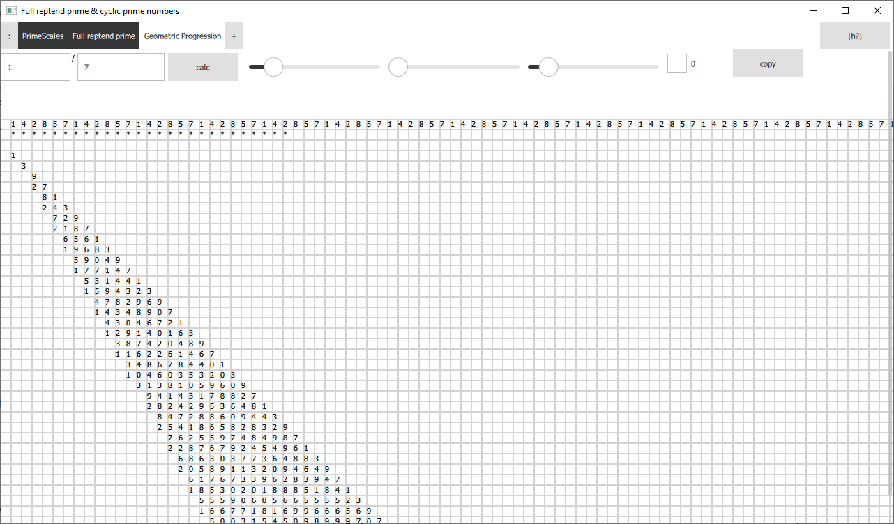

# Cyclic prime numbers

This is aplication to visualise few of mathematical regularities related to the themes:
- Cyclic numbers
- Full reptend prime numbers

And it show how cyclic prime numbers class appears, was used to write a paper:
_link to be inserted_


## History

Started as C++ console apliction, then was built as C++ with Qt GUI, later most of the code was migrated into Python.
It was a part of another project, but not it reduces to this very few pages and components.

## Usage

To start run 'python ath.py'

Aplication is a browser that can open qml files located in folders components and pages.
You can edit any page on the go, if MD5 of page becomes different engine would reload it.

There are few prepared pages, first of them opened as default, rest could be opened using button '+'.

Description of pages and components:

- PrimeScales - shows length of periods for 1/P in different Numeric Systems, useful to see many full reptend primes at once, and structure of their appearence



Clicking on each cell you can find a fraction made from 1/P in certain numeric system, then you can jump from it into different pages



- FullRepentPrime - shows some regularities of full reptend prime numbers - it may be opened from PrimeScales page



- ManyRationals - interesting animation, that represents the structure that appears in cyclic numbers, it is called so because it contains at least P-1 animations of rationals made from 1/P to P-1/P

- GeometricProgression - component for visualisation of infinite geometric progressions that 1/P can be represented



- Calculating cyclic prime numbers - used from console, run python ath.py -c P [N], where P is prime number and N is numeric system, if it is absent there would be a search for multiple numeric systems

- Cyclic primes - makes almost the same thing but not from console, it has limits for calculations, as it cannot be too long in GUI case

- NumericSystem - simple page for converting one number from one numeric system into another

- PrimeFactor - page that can factor integer number, or check first N digits from 1/P finging its prime factors

## Requirements

```
pip install PySide2
pip install factordb-pycli
pip install sympy
pip install gmpy2
```

FactorDB - is a library for prime numbers factorisation, it uses connection to internet.
Sympy is optional and used for prime factorisation of small numbers, but usage of full reptend prime page is much slower without it.
Also you may epxerience issue of installing gmpy2 on windows, in this case you may use unofficial wheel:
https://www.lfd.uci.edu/~gohlke/pythonlibs/

Project was running at Linux/MacOs/Windows - but the very last version tested only on Windows.

## Excuses

This project is far from being nice coded, and right now it mostly abadoned. 

In this repository may appear later some new work related to full reptend prime numbers and geometric progressions, but the rest of the code is not going to be supported in Python.

This code is published for education purpose, as a support for the paper 'Cyclic prime numbers'.

Originaly project was planned as part of interactive engine that was developed for chat messaging, this project was failed to support using Python on mobile devices.
For now it is abadoned - but if it would be reincarneded link would appear here.
I tried my best to make it nice, but with time limits its still far from I wanted.

Anyway, I hope you will enjoy the mathematics behind this code :)

## Notice

This repo is a clone of https://github.com/eversearch/cyclicprime

Both repositories would be present for historical resons, but further development would appear in current one.

Cyclic prime numbers propbably wouldn't be involed in this code, but few other themes for following papers would be done here.